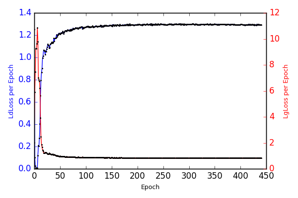
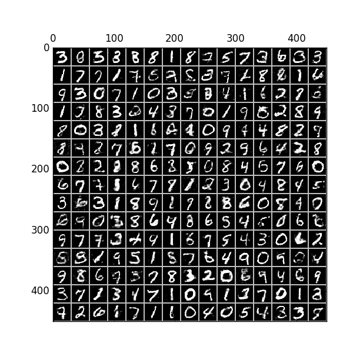

# GAN
The picture come from [znxlwm](https://github.com/znxlwm/tensorflow-MNIST-GAN-DCGAN)

Draw on the idea above, we find that: 

> The final layer of generator which is imposed on the sigmoid activation is hard to train. However if we change the activation to tanh,
the model is easy to train.

## Structure

Generator: 1200Relu-1200Relu-784Tanh

Discriminator: 240Maxout(5)-240Maxout(5)-1Sigmoid

## Result

