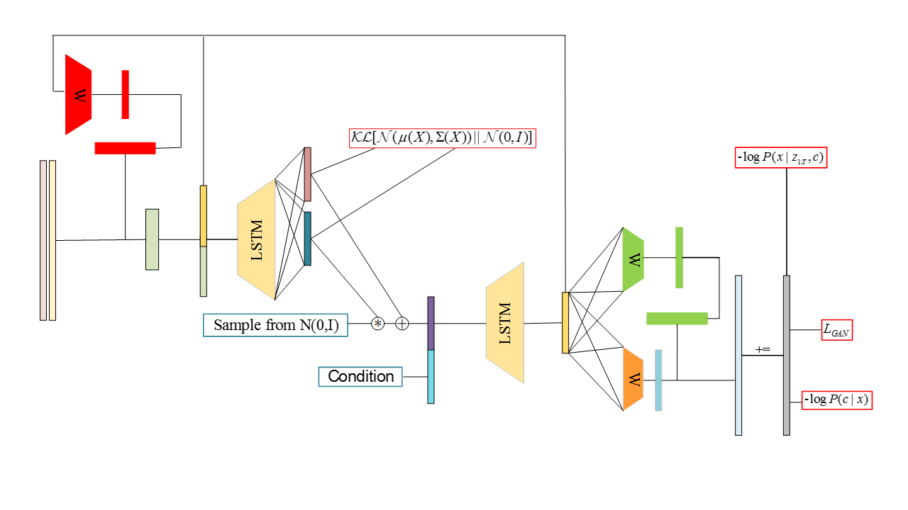
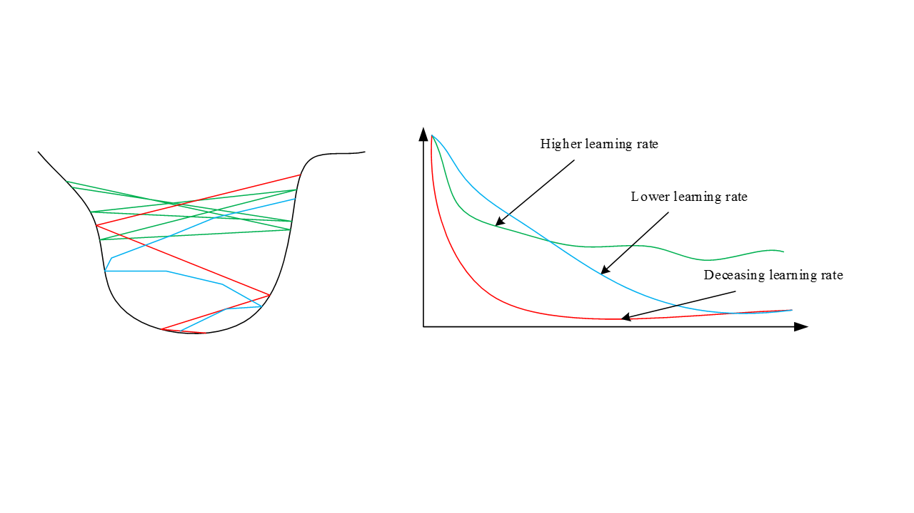

# Draw
A Recurrent Neural network for Image Generation, 2015

## DRAW Structure

## Attention 

KL divergence and Cross Entropy are the drive force, putting the cycle more and more efficient

## Read & Write 

Tips
- Filterbank matrices are determined by the precious decoder output

## Result
The canvas can not be start with zero, otherwise sigmoid(zero)=0.5 and the canvas will be gray at begaining.
Like the following 

  

However the generated images are misarable. Guess that the noise dimensions are blamed for the shapeless image 

Remark:
- learning rate decay(exponent) is vatal to stable the training process and its value can be very large such as 0.01

- when the size of model decrease, the learning rate need to decay very quickly, 
So the Epoch need to be decrease as well --> e.g. when the hidden size is 100, the max epoch is 50K.
By contrast, the epochs is 250K while while the size 10. 

- The reference process does not meet the expectation

Finally the cause I found will be explained in the next section.

# Draw_update

- Add labels to decoder
- Add a new network to recognize the labels

# Random variable 
Here I write some [explanition for ericjang's poor result](https://github.com/DreamPurchaseZnz/Tensorflow_Learning/blob/master/Constants,%20Sequences,%20and%20Random%20Values.md)
because of the random variable defination is a mistake.

## Learning rate
Bigger learning rate is not always better. Despite the fact that big learning rate can speed the learning process, it also
can cause the osillation between the optim. It is hard to converge.

## result of draw

Remark:

- the figure in the test.gif has some unknown numbers.

## Reference
Theano

- [jbornschein](https://github.com/jbornschein/draw) (**Recommend**)

Pytorch: 

- [chenzhaomin123](https://github.com/chenzhaomin123/draw_pytorch)
- [skaae](https://github.com/skaae/lasagne-draw)(**Recommend**)

Tensorflow: 
- [ericjang](https://github.com/ericjang/draw)(A mistake about random variable defination)
- [mnist](https://github.com/lovecambi/DRAW) (**Recommend**)
- [birds](https://github.com/hollygrimm/draw_birds)
- [1D](https://github.com/RobRomijnders/DRAW_1D)
- [Automatic GIF Generation](https://github.com/Singularity42/Sync-DRAW)
- [Automatic GIF Generation2](https://github.com/syncdraw/Sync-DRAW)
